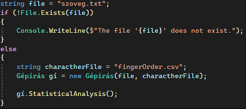

# Gépírás
A program célja, hogy elemzést végezzen a gépírás mintákról. A program a `szoveg.txt` és a `fingerOrder.csv` fájlokat olvassa be, majd statisztikai elemzést végez az ujjak terheléséről, és létrehoz egy `karakteradatgyujtes`.txt fájlt, amely tartalmazza, hogy melyik karaktert melyik ujj hányszor nyomta le.
## Működés
1. Megállapítjuk hogy a `szoveg.txt` létezik-e.

2. 